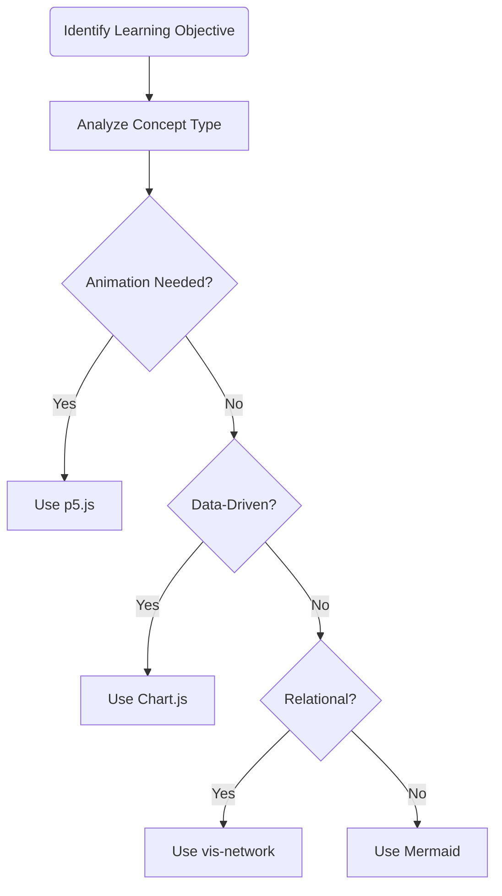

# Visualization Libraries and Tools

## Summary

This chapter introduces the JavaScript libraries and tools used to implement MicroSims. You will learn about p5.js for animations, vis-network for relationship graphs, vis-timeline for temporal displays, Chart.js and Plotly for data visualizations, Leaflet for maps, and Mermaid for diagrams. The chapter also covers Claude Code skills, the MicroSim generator, template libraries, and code generation workflows. By understanding these tools, you will be able to select the right technology for implementing any visualization paradigm.

## Concepts Covered

This chapter covers the following 15 concepts from the learning graph:

1. p5.js Animation
2. vis-network Library
3. Timeline Visualization
4. vis-timeline Library
5. Chart Visualization
6. Chart.js Library
7. Plotly Library
8. Map Visualization
9. Leaflet Library
10. Diagram Visualization
11. Mermaid Library
12. Claude Code Skills
13. MicroSim Generator
14. Template Library
15. Code Generation

## Prerequisites

This chapter builds on concepts from:

- [Chapter 3: The MicroSim Pattern Library](../03-microsim-pattern-library/index.md)

---

## Welcome to the Visualization Toolbox

Congratulations! You've made it to what we affectionately call the "candy store" chapter of this course. Here, we'll explore the delightful array of JavaScript libraries that transform abstract learning objectives into interactive, engaging visual experiences. Think of these libraries as your artistic palette, each color uniquely suited for painting different educational masterpieces.

The beauty of modern web development is that you don't need to reinvent the wheel (or the slider, or the graph, or the map). Brilliant developers have created open-source libraries that handle the heavy lifting, allowing you to focus on what matters most: designing experiences that help people learn. As the saying goes, "Why write a thousand lines of code when you can import one library and write ten?"

This chapter will equip you with the knowledge to select the right tool for any educational visualization challenge. By the end, you'll be like a well-stocked craftsperson, reaching confidently for p5.js when animation is needed, vis-network when relationships matter, or Chart.js when data needs to speak. Let's dive in!

<iframe src="../../sims/viz-library-decision/main.html" height="502px" width="100%" scrolling="no" style="overflow: hidden;"></iframe>

[Run MicroSim Fullscreen](../../sims/viz-library-decision/main.html){ .md-button .md-button--primary }

#### Diagram: Visualization Library Decision Tree

<details markdown="1">
<summary>Visualization Library Decision Tree</summary>
Type: diagram

Bloom Taxonomy: Understand

Learning Objective: Help learners understand which visualization library to select based on their learning objective characteristics

Purpose: Guide learners through the decision-making process of selecting the appropriate JavaScript library for their MicroSim based on the type of content being visualized

Components to show:
- Start node: "What type of content?"
- Decision branches for: Animation/Physics, Data/Statistics, Relationships/Networks, Time-based, Geographic, Process/Workflow
- Library endpoints: p5.js, Chart.js, Plotly, vis-network, vis-timeline, Leaflet, Mermaid

Flow structure:
1. Start → "Is it animated or physics-based?"
   - Yes → p5.js
   - No → Continue
2. "Is it data/statistics?"
   - Yes → "Need mathematical functions?" → Yes → Plotly, No → Chart.js
   - No → Continue
3. "Shows relationships/networks?"
   - Yes → vis-network
   - No → Continue
4. "Time-based/chronological?"
   - Yes → vis-timeline
   - No → Continue
5. "Geographic/location-based?"
   - Yes → Leaflet
   - No → Mermaid (process/workflow default)

Visual style: Top-down flowchart with colored decision diamonds and rectangular library nodes
Color scheme: Decision nodes in light purple, library endpoints in distinct colors matching their brand identities (p5.js pink, Chart.js orange, Plotly blue, vis-network teal, vis-timeline green, Leaflet forest green, Mermaid purple)

Implementation: Mermaid flowchart or vis-network with hierarchical layout
</details>

---

## p5.js: The Swiss Army Knife of Animation

If JavaScript libraries were superheroes, p5.js would be the one that can fly, has super strength, AND makes excellent coffee. Originally created by Lauren McCarthy as a way to make coding accessible to artists and designers, p5.js has become the go-to library for creative, animated, and interactive visualizations on the web.

### What Makes p5.js Special?

p5.js excels at creating custom animations, physics simulations, and interactive visual experiences. Unlike libraries designed for specific chart types, p5.js gives you a blank canvas and says, "Go wild!" This flexibility makes it perfect for educational simulations where you need precise control over every pixel.

Key characteristics of p5.js include:

- **The setup() and draw() paradigm**: Initialize once, then loop continuously
- **Immediate mode rendering**: Every frame, you draw everything from scratch
- **Built-in functions**: Shapes, colors, transformations, all at your fingertips
- **Mouse and keyboard handling**: Interactivity made simple
- **Width-responsive design**: Adapts to container size automatically

### The Anatomy of a p5.js MicroSim

Every p5.js MicroSim follows a consistent structure with distinct regions for drawing and controls. This separation keeps the educational content visually clean while providing interactive elements below.

```javascript
// Canvas dimensions - the foundation of every MicroSim
let canvasWidth = 400;              // Initial width (responsive)
let drawHeight = 400;               // Drawing/simulation area height
let controlHeight = 50;             // Controls area height
let canvasHeight = drawHeight + controlHeight;

function setup() {
  updateCanvasSize();               // Get container width first!
  const canvas = createCanvas(canvasWidth, canvasHeight);
  canvas.parent(document.querySelector('main'));

  // Create your sliders and controls here
  describe('Educational description for screen readers', LABEL);
}

function draw() {
  updateCanvasSize();

  // Drawing area (light blue background)
  fill('aliceblue');
  stroke('silver');
  rect(0, 0, canvasWidth, drawHeight);

  // Control area (white background)
  fill('white');
  noStroke();
  rect(0, drawHeight, canvasWidth, controlHeight);

  // Your visualization code goes here
}
```

!!! tip "Always Start with updateCanvasSize()"
    The most common mistake new MicroSim creators make is forgetting to call `updateCanvasSize()` at the beginning of `setup()`. This function reads the container width and ensures your simulation adapts to any screen size.

### When to Choose p5.js

p5.js is your best friend when you need:

| Use Case | Example |
|----------|---------|
| Physics simulations | Bouncing balls, projectile motion, pendulums |
| Custom animations | Visualizing algorithms, state changes |
| Interactive exploration | Parameter spaces, function behavior |
| Game-like experiences | Educational games, gamified assessments |
| Creative visualizations | Generative art, data sonification |

However, p5.js might be overkill for standard charts or diagrams. If you're just plotting bar charts, Chart.js will get you there faster. Think of it this way: you *could* use a chainsaw to cut butter, but a butter knife is probably more appropriate.

<iframe src="../../sims/p5-architecture/main.html" height="502px" width="100%" scrolling="no" style="overflow: hidden;"></iframe>

[Run MicroSim Fullscreen](../../sims/p5-architecture/main.html){ .md-button .md-button--primary }

#### Diagram: p5.js MicroSim Architecture

<details markdown="1">
<summary>p5.js MicroSim Architecture</summary>
Type: diagram

Bloom Taxonomy: Understand

Learning Objective: Visualize the standard structure of a p5.js MicroSim with its distinct regions and responsive design

Components to show:
- Container (main element in HTML)
- Canvas (created by p5.js)
- Draw Region (top area with aliceblue background)
- Control Region (bottom area with white background)
- Slider elements in control region
- Labels in control region

Layout:
- Vertical stack showing:
  1. Browser window frame
  2. Main container (full width)
  3. Canvas divided into:
     - Top: Draw region (labeled "drawHeight")
     - Bottom: Control region (labeled "controlHeight")
  4. Arrows showing responsive width behavior

Annotations:
- "canvasWidth = container.offsetWidth" pointing to width
- "Fixed heights, variable width" annotation
- "updateCanvasSize() called each frame" near draw loop indicator

Color scheme: Draw region in aliceblue, control region in white, canvas border in silver

Implementation: Mermaid block diagram or p5.js static rendering
</details>

---

## Chart Visualization: Telling Stories with Data

Data without visualization is like a joke without a punchline: technically complete, but missing the impact. Charts transform raw numbers into visual patterns that our pattern-recognizing brains can instantly comprehend. In this section, we'll explore two powerful charting libraries: Chart.js for simplicity and Plotly for sophistication.

### Chart.js: Simple, Beautiful, and Fast

Chart.js is the library you reach for when you need a professional-looking chart in minutes, not hours. It supports all the standard chart types that business professionals and educators love:

- **Line charts**: Trends over time, continuous data
- **Bar charts**: Comparing categories, discrete values
- **Pie and Doughnut charts**: Parts of a whole (use sparingly!)
- **Radar charts**: Multi-dimensional comparisons
- **Scatter plots**: Correlations and distributions
- **Bubble charts**: Three-dimensional data visualization

#### Chart.js in Action

Here's the basic pattern for creating a Chart.js visualization:

```javascript
const ctx = document.getElementById('myChart').getContext('2d');
const myChart = new Chart(ctx, {
    type: 'bar',  // or 'line', 'pie', 'doughnut', 'radar', 'scatter'
    data: {
        labels: ['Category A', 'Category B', 'Category C'],
        datasets: [{
            label: 'Dataset 1',
            data: [65, 59, 80],
            backgroundColor: 'rgba(54, 162, 235, 0.8)',
            borderColor: 'rgb(54, 162, 235)',
            borderWidth: 1
        }]
    },
    options: {
        responsive: true,
        scales: {
            y: { beginAtZero: true }
        }
    }
});
```

Chart.js handles tooltips, legends, and animations automatically. It's like having a skilled graphic designer on call who works for free and never complains about deadlines.

| Chart Type | Best For | Avoid When |
|------------|----------|------------|
| Line | Trends over time | Categorical comparisons |
| Bar | Comparing categories | Continuous data |
| Pie/Doughnut | Parts of whole (3-6 slices) | More than 6 categories |
| Radar | Multi-variable comparison | Single variable analysis |
| Scatter | Correlations | Categorical data |

### Plotly: When You Need Mathematical Muscle

While Chart.js excels at standard business charts, Plotly shines when you need to plot mathematical functions, create scientific visualizations, or provide advanced interactivity. Plotly is particularly powerful for:

- **Mathematical function plots**: $f(x) = \sin(x)$, polynomial curves, exponential growth
- **Interactive exploration**: Hover tooltips showing precise coordinates
- **Slider integration**: Move points along curves to explore function behavior
- **Scientific notation**: Proper axis formatting for technical content

```javascript
function f(x) {
    return Math.sin(x);  // Your mathematical function
}

// Generate data points
const x = [];
const y = [];
for (let i = -6.28; i <= 6.28; i += 0.01) {
    x.push(i);
    y.push(f(i));
}

// Create the plot
Plotly.newPlot('plot', [{
    x: x,
    y: y,
    type: 'scatter',
    mode: 'lines',
    name: 'y = sin(x)'
}], {
    responsive: true,
    title: 'Sine Function Visualization'
});
```

!!! note "Choosing Between Chart.js and Plotly"
    Use **Chart.js** when you're visualizing discrete data categories or need standard business charts. Use **Plotly** when you're plotting continuous mathematical functions or need advanced scientific visualization features.

<iframe src="../../sims/chart-type-selection/main.html" height="502px" width="100%" scrolling="no" style="overflow: hidden;"></iframe>

[Run MicroSim Fullscreen](../../sims/chart-type-selection/main.html){ .md-button .md-button--primary }

#### Diagram: Chart Type Selection Guide

<details markdown="1">
<summary>Chart Type Selection Guide</summary>
Type: infographic

Bloom Taxonomy: Apply

Learning Objective: Help learners quickly identify the appropriate chart type based on their data characteristics and communication goals

Layout: 2x3 grid of chart type cards with decision criteria

Cards (each with small icon, name, use case, and example):
1. Line Chart
   - Icon: Simple line graph
   - Use when: Showing trends over time
   - Example: "Stock prices over 12 months"
   - Library: Chart.js or Plotly

2. Bar Chart
   - Icon: Vertical bars
   - Use when: Comparing categories
   - Example: "Sales by region"
   - Library: Chart.js

3. Pie/Doughnut
   - Icon: Pie segments
   - Use when: Parts of a whole (max 6)
   - Example: "Market share distribution"
   - Library: Chart.js

4. Scatter Plot
   - Icon: Scattered dots
   - Use when: Showing correlations
   - Example: "Height vs. weight"
   - Library: Chart.js or Plotly

5. Function Plot
   - Icon: Curved line (sine wave)
   - Use when: Mathematical functions
   - Example: "y = sin(x)"
   - Library: Plotly

6. Radar Chart
   - Icon: Spider web shape
   - Use when: Multi-variable comparison
   - Example: "Skill assessment profiles"
   - Library: Chart.js

Color coding: Each card has a distinct background color
Interactive features: Hover over each card to see expanded description

Implementation: HTML/CSS grid with Chart.js mini-examples or static images
</details>

---

## vis-network: When Relationships Are Everything

Some concepts are inherently relational. Consider learning graphs, organizational hierarchies, social networks, or dependency structures. These concepts don't fit neatly into rows and columns; they exist as webs of connections. Enter vis-network, a library designed specifically for visualizing nodes and edges.

### Understanding Network Visualization

A network visualization consists of two fundamental elements:

- **Nodes**: The entities (concepts, people, systems, components)
- **Edges**: The relationships between entities (dependencies, connections, influences)

vis-network brings these elements to life with physics-based layouts, smooth animations, and rich interactivity. Nodes can be dragged, clusters can be expanded, and hovering reveals details. It transforms static relationship data into an explorable landscape.

### The vis-network Architecture Pattern

When creating a vis-network MicroSim, we follow a standardized layout called "vis-network-tutorial":

- **Graph on the left**: The network visualization occupies most of the canvas
- **Controls on the right**: Interactive controls and status panels
- **Title at top center**: Clear identification
- **Legend in upper left**: Color and symbol key

```javascript
// Define nodes with fixed positions for educational clarity
const nodeData = [
    { id: 1, label: 'Learning Objective', x: -300, y: -100 },
    { id: 2, label: 'Prerequisite 1', x: -450, y: 50 },
    { id: 3, label: 'Prerequisite 2', x: -150, y: 50 },
    { id: 4, label: 'Foundation Concept', x: -300, y: 200 }
];

// Define edges (relationships)
const edgeData = [
    { from: 2, to: 1, label: 'enables' },
    { from: 3, to: 1, label: 'enables' },
    { from: 4, to: 2 },
    { from: 4, to: 3 }
];

// Critical: Disable mouse zoom for iframe embedding!
const options = {
    interaction: {
        zoomView: false,        // Prevents scroll hijacking
        dragView: false,        // Prevents accidental panning
        navigationButtons: true // Provides explicit zoom controls
    },
    physics: { enabled: false } // Use fixed positions for clarity
};
```

!!! warning "Always Disable Mouse Zoom in iframes"
    When embedding vis-network in a textbook via iframe, you MUST disable `zoomView` and `dragView`. Otherwise, users scrolling through your textbook will accidentally zoom the diagram instead of scrolling the page. This is one of the most common usability mistakes in educational visualizations.

### When vis-network Shines

vis-network is the perfect choice for:

- **Learning graphs**: Showing concept dependencies and prerequisites
- **Knowledge maps**: Visualizing how topics interconnect
- **Organizational structures**: Beyond simple hierarchies
- **System architectures**: Component relationships
- **Social networks**: Influence and connection patterns
- **Causal diagrams**: Cause-and-effect relationships

<iframe src="../../sims/learning-dependency-network/main.html" height="502px" width="100%" scrolling="no" style="overflow: hidden;"></iframe>

[Run MicroSim Fullscreen](../../sims/learning-dependency-network/main.html){ .md-button .md-button--primary }

#### Diagram: Learning Dependency Network Example

<details markdown="1">
<summary>Learning Dependency Network Example</summary>
Type: graph-model

Bloom Taxonomy: Analyze

Learning Objective: Demonstrate how vis-network can visualize learning dependencies between concepts, showing prerequisites flowing to target learning objectives

Node types:
1. Foundation concepts (gray circles)
   - Example: "Basic Arithmetic"
2. Prerequisite concepts (light blue rectangles)
   - Example: "Variables", "Functions"
3. Target concept (green hexagon)
   - Example: "Calculus"
4. Advanced concepts (purple diamonds)
   - Example: "Differential Equations"

Edge types:
1. PREREQUISITE_OF (solid arrows)
   - Points from prerequisite to dependent concept
2. EXTENDS (dashed arrows)
   - Points from concept to advanced application

Sample data structure:
- Basic Arithmetic → Variables
- Basic Arithmetic → Functions
- Variables → Algebra
- Functions → Algebra
- Algebra → Calculus
- Calculus → Differential Equations

Layout: Hierarchical with foundation concepts at bottom, target concepts at top

Interactive features:
- Click node to highlight all prerequisites
- Hover to see concept definition
- Step-through mode to show learning path
- Legend explaining node types and colors

Color scheme:
- Foundation: #e0e0e0 (gray)
- Prerequisites: #4facfe (blue)
- Target: #4caf50 (green)
- Advanced: #9c27b0 (purple)

Implementation: vis-network JavaScript library with hierarchical layout
</details>

---

## Timeline Visualization: History Comes Alive

Time is the fourth dimension, and vis-timeline helps you visualize it beautifully. Whether you're teaching historical events, project phases, or evolutionary processes, timeline visualizations place events in their temporal context, helping learners understand sequence, duration, and causality.

### The Power of Temporal Context

Consider teaching the history of computing. You could list events:

- 1943: ENIAC development begins
- 1969: ARPANET goes live
- 1989: Tim Berners-Lee proposes the World Wide Web

Or you could *show* them on a timeline, letting learners see the gaps, the clusters of innovation, and the accelerating pace of change. Visual timelines answer questions like "How long between X and Y?" instantly, without calculation.

### vis-timeline Features

The vis-timeline library provides:

- **Zoom and pan**: Explore different time scales
- **Category filtering**: Show/hide event categories
- **Hover tooltips**: Additional context without clutter
- **Click for details**: Full event descriptions
- **Date ranges**: Events with duration, not just points

```javascript
// Timeline data structure
const events = [
    {
        id: 1,
        content: 'ARPANET Goes Live',
        start: '1969-10-29',
        group: 'networking',
        title: 'First message sent over ARPANET: "LO" (the system crashed before "LOGIN")'
    },
    {
        id: 2,
        content: 'World Wide Web Proposed',
        start: '1989-03-12',
        group: 'web',
        title: 'Tim Berners-Lee submits "Information Management: A Proposal"'
    }
];

// Timeline options
const options = {
    zoomable: false,  // Use buttons instead (prevents scroll hijacking)
    moveable: true,   // Allow click-and-drag panning
    showCurrentTime: false,
    tooltip: { followMouse: true }
};
```

### Timeline Best Practices for Education

When creating educational timelines:

1. **Limit categories to 3-6**: Too many colors become confusing
2. **Provide rich tooltips**: Include "why this matters" context
3. **Use consistent date formatting**: Choose one style and stick with it
4. **Add navigation buttons**: Since scroll-zoom is disabled, provide explicit controls
5. **Include a "Fit All" button**: Let users reset to see the full timeline

---

## Map Visualization: Geography Matters

Some learning objectives are inherently spatial. Migration patterns, global events, regional comparisons, facility layouts: these concepts need maps. Leaflet is the leading open-source JavaScript library for interactive maps, and it integrates beautifully into educational MicroSims.

### Leaflet Fundamentals

Leaflet provides:

- **Multiple tile layers**: Street maps, satellite imagery, terrain
- **Markers with popups**: Click for information
- **GeoJSON support**: Complex regions and boundaries
- **Layer controls**: Toggle different data layers
- **Responsive design**: Works on mobile devices

```javascript
// Initialize the map
const map = L.map('map').setView([37.7749, -122.4194], 10);

// Add a tile layer (OpenStreetMap)
L.tileLayer('https://{s}.tile.openstreetmap.org/{z}/{x}/{y}.png', {
    attribution: '© OpenStreetMap contributors'
}).addTo(map);

// Add markers
L.marker([37.7749, -122.4194])
    .bindPopup('<b>San Francisco</b><br>The tech capital!')
    .addTo(map);
```

### Educational Map Applications

Maps are essential for teaching:

| Subject Area | Map Application |
|--------------|-----------------|
| History | Battle movements, empire expansions |
| Geography | Climate zones, population density |
| Science | Specimen locations, geological features |
| Business | Market regions, supply chains |
| Environmental | Pollution patterns, conservation areas |

!!! tip "Always Include Attribution"
    When using OpenStreetMap tiles, include proper attribution. It's not just polite; it's required by the license. Plus, acknowledging the work of open-source communities models good academic practice for your learners.

---

## Mermaid: Diagrams from Text

Sometimes you need a diagram, but you don't need interactivity. You need a flowchart, a state diagram, or an entity-relationship diagram. Mermaid lets you create these from simple text descriptions, making them easy to version control, modify, and maintain.

### The Joy of Text-Based Diagrams

Consider this Mermaid flowchart definition:



From this simple text, Mermaid generates a professional flowchart. No drag-and-drop required. No pixel-pushing. Just describe the structure, and Mermaid renders it.

### Mermaid Diagram Types

Mermaid supports multiple diagram types:

- **Flowcharts**: Process flows and decision trees
- **Sequence diagrams**: Interactions over time
- **State diagrams**: State machines and lifecycles
- **Entity-relationship diagrams**: Database schemas
- **Class diagrams**: Object-oriented structures
- **User journey maps**: UX flows

### Styling Mermaid for Education

For educational textbooks, we enhance Mermaid diagrams with:

- **16-point fonts**: Readable from the back of the classroom
- **Colorful backgrounds**: Visual distinction between node types
- **Interactive tooltips**: Educational context on hover

```mermaid
classDef startNode fill:#667eea,stroke:#333,stroke-width:2px,color:#fff,font-size:16px
classDef processNode fill:#764ba2,stroke:#333,stroke-width:2px,color:#fff,font-size:16px
classDef decisionNode fill:#f093fb,stroke:#333,stroke-width:2px,color:#333,font-size:16px
```

<iframe src="../../sims/microsim-generation-workflow/main.html" height="502px" width="100%" scrolling="no" style="overflow: hidden;"></iframe>

[Run MicroSim Fullscreen](../../sims/microsim-generation-workflow/main.html){ .md-button .md-button--primary }

#### Diagram: MicroSim Generation Workflow

<details markdown="1">
<summary>MicroSim Generation Workflow</summary>
Type: workflow

Bloom Taxonomy: Apply

Learning Objective: Show the complete workflow from learning objective to deployed MicroSim, emphasizing the role of Claude Code skills

Purpose: Illustrate the step-by-step process of generating a MicroSim using AI-assisted tools

Visual style: Flowchart with swimlanes

Swimlanes:
1. Instructional Designer
2. Claude Code
3. MicroSim Files

Steps:
1. Start: "Define Learning Objective" (Designer)
   Hover: "What specific concept should students understand?"

2. Process: "Analyze Concept Type" (Designer)
   Hover: "Is it animated? Data-driven? Relational? Geographic?"

3. Process: "Select Library Type" (Designer)
   Hover: "Based on concept type, choose p5.js, Chart.js, vis-network, etc."

4. Process: "Write Specification" (Designer)
   Hover: "Describe the MicroSim in detail: visual elements, controls, data"

5. Process: "Invoke MicroSim Generator Skill" (Claude Code)
   Hover: "AI generates code following library-specific patterns"

6. Process: "Generate Files" (MicroSim Files)
   Hover: "main.html, script.js, style.css, index.md, metadata.json"

7. Decision: "Test in Browser" (Designer)
   Hover: "Does it work? Does it teach the concept effectively?"

8a. Process: "Iterate with Feedback" (Claude Code) - if issues
   Hover: "Refine based on testing results"

8b. Process: "Deploy to Textbook" (MicroSim Files) - if success
   Hover: "Add to mkdocs.yml navigation, embed via iframe"

9. End: "MicroSim Live!" (All)

Color coding:
- Designer steps: Blue (#2196f3)
- Claude Code steps: Purple (#9c27b0)
- File operations: Green (#4caf50)
- Decision: Yellow (#ffc107)

Implementation: Mermaid flowchart with swimlane structure
</details>

---

## Claude Code Skills: AI-Powered Generation

Now we arrive at the magic that ties everything together: Claude Code skills. These are specialized AI capabilities that can generate complete, working MicroSims from natural language descriptions. Instead of writing hundreds of lines of JavaScript yourself, you describe what you want, and the skill produces production-ready code.

### What Are Claude Code Skills?

A Claude Code skill is a set of instructions and templates that guide AI-assisted code generation. Each skill knows:

- **The target library**: p5.js, Chart.js, vis-network, etc.
- **Required file structure**: main.html, script.js, style.css, etc.
- **Best practices**: Responsive design, accessibility, educational patterns
- **Common pitfalls**: What to avoid and how to fix issues

### The MicroSim Generator Ecosystem

The microsim-generator skill is actually a *router* that directs requests to specialized sub-skills:

| Sub-Skill | Library | Primary Use |
|-----------|---------|-------------|
| microsim-p5 | p5.js | Animations, physics simulations |
| chartjs-generator | Chart.js | Standard data charts |
| math-function-plotter-plotly | Plotly.js | Mathematical function plots |
| vis-network | vis-network | Relationship graphs |
| timeline-generator | vis-timeline | Chronological events |
| map-generator | Leaflet | Geographic visualizations |
| mermaid-generator | Mermaid | Flowcharts and diagrams |

### How Skills Match to Requests

When you invoke the MicroSim generator, it analyzes your request for trigger words and data characteristics:

- "bouncing ball simulation" → microsim-p5 (animation, physics)
- "bar chart comparing sales" → chartjs-generator (categorical data)
- "plot sine function" → math-function-plotter-plotly (mathematical function)
- "show concept dependencies" → vis-network (nodes and edges)
- "timeline of historical events" → timeline-generator (dates)
- "map of university locations" → map-generator (coordinates)
- "flowchart of the process" → mermaid-generator (workflow)

!!! note "Routing Criteria"
    The MicroSim generator uses a scoring system (0-100) to match requests to skills. A score of 90-100 means perfect match; 70-89 is strong match; 50-69 is moderate. The generator selects the highest-scoring skill for your request.

---

## Template Libraries: Standing on Shoulders

Every MicroSim follows a standard file structure that makes maintenance, modification, and sharing straightforward. This modularity is not just good engineering; it's pedagogically sound. When learners (or other instructors) want to modify a MicroSim, they know exactly where to look.

### The Standard MicroSim Structure

```
docs/sims/[microsim-name]/
├── index.md          # Documentation with iframe embed
├── main.html         # HTML container with library CDN links
├── script.js         # All visualization logic
├── style.css         # Responsive styling
├── data.json         # Data separated from code (optional)
└── metadata.json     # Dublin Core metadata
```

This separation provides several benefits:

- **Data independence**: Update data without touching code
- **Style customization**: Change appearance without logic changes
- **Documentation co-location**: Explanation lives with the code
- **Metadata for search**: Faceted search engines can find MicroSims
- **Version control friendly**: Each file has a clear purpose

### Template Components

Each template type includes:

1. **HTML boilerplate**: Proper meta tags, CDN links, semantic structure
2. **CSS defaults**: aliceblue background, responsive breakpoints, iframe-friendly margins
3. **JavaScript patterns**: Standard initialization, event handling, responsive updates
4. **Documentation structure**: Consistent sections for overview, features, customization

### URL Parameters for Extended Functionality

MicroSims can accept URL parameters for special modes:

```html
<!-- Normal mode -->
<iframe src="main.html" height="500"></iframe>

<!-- Quiz mode: Enable assessment features -->
<iframe src="main.html?quiz-mode=true" height="500"></iframe>

<!-- Editor mode: Allow dragging nodes to new positions -->
<iframe src="main.html?editor-mode=true" height="500"></iframe>
```

These parameters enable the same MicroSim to serve multiple purposes without code duplication.

---

## Code Generation: From Specification to Working MicroSim

The final piece of our puzzle is understanding how specifications become working code. This is where the rubber meets the road, where learning objectives transform into interactive experiences.

### The Specification-to-Code Pipeline

The code generation process follows these steps:

1. **Specification writing**: Describe the MicroSim in detail
2. **Skill invocation**: Call the appropriate generator skill
3. **Template selection**: Match request to templates
4. **Placeholder replacement**: Fill in specific values
5. **Code generation**: Produce all required files
6. **Validation**: Test and iterate

### What Makes a Good Specification?

A specification should include:

- **Learning objective**: What concept will learners understand?
- **Visual elements**: What should appear on screen?
- **Interactive controls**: Sliders, buttons, checkboxes?
- **Default values**: Initial state of all parameters
- **Behavior description**: What happens when users interact?
- **Edge cases**: What should happen at extreme values?

<iframe src="../../sims/spec-quality-checklist/main.html" height="502px" width="100%" scrolling="no" style="overflow: hidden;"></iframe>

[Run MicroSim Fullscreen](../../sims/spec-quality-checklist/main.html){ .md-button .md-button--primary }

#### Diagram: Specification Quality Checklist

<details markdown="1">
<summary>Specification Quality Checklist</summary>
Type: infographic

Bloom Taxonomy: Evaluate

Learning Objective: Help learners evaluate the completeness and quality of their MicroSim specifications before generation

Layout: Checklist-style infographic with categories

Categories with checkboxes:

**Educational Foundation**
- [ ] Learning objective clearly stated
- [ ] Bloom's taxonomy level identified
- [ ] Target audience specified
- [ ] Prerequisites noted

**Visual Design**
- [ ] All visual elements described
- [ ] Colors specified (or defaults accepted)
- [ ] Layout structure defined
- [ ] Responsive behavior noted

**Interactivity**
- [ ] All controls listed
- [ ] Control ranges and defaults specified
- [ ] User actions and responses described
- [ ] Edge case behavior defined

**Technical Details**
- [ ] Library type identified
- [ ] Data structure described
- [ ] File naming convention followed
- [ ] Integration method specified

Visual style: Clean checklist with green checkmarks, organized in expandable sections

Implementation: HTML/CSS interactive checklist or static infographic
</details>

### Iterative Refinement

Code generation is rarely one-and-done. The typical workflow is:

1. **Generate** initial version from specification
2. **Test** in browser (both standalone and in iframe)
3. **Identify** issues or improvements needed
4. **Refine** specification or request changes
5. **Regenerate** or modify existing code
6. **Repeat** until satisfied

This iterative approach mirrors the broader instructional design process. Just as learning objectives are refined through testing with actual learners, MicroSim specifications are refined through testing with actual browsers.

!!! tip "Future Enhancement: xAPI Integration"
    While not covered in this chapter, MicroSims can be extended with xAPI (Experience API) protocols to track learner interactions. Every slider movement, button click, and visualization state can be logged to a Learning Record Store (LRS) for analytics. This capability will be explored in a later chapter on learning analytics.

---

## Putting It All Together: The Library Selection Matrix

After exploring all these libraries, you might feel like a kid in a candy store, unsure which treat to pick first. Here's a comprehensive matrix to guide your selection:

| If Your Concept... | Use This Library | Key Strength |
|-------------------|------------------|--------------|
| Involves motion, physics, or custom animation | p5.js | Complete flexibility |
| Compares categories with standard charts | Chart.js | Quick, professional results |
| Plots mathematical functions | Plotly | Scientific precision |
| Shows relationships between entities | vis-network | Interactive exploration |
| Displays events over time | vis-timeline | Temporal navigation |
| Involves geographic locations | Leaflet | Real-world mapping |
| Describes processes or workflows | Mermaid | Text-based simplicity |

### The Decision Framework

When selecting a library, ask these questions in order:

1. **Is animation or physics essential?** → p5.js
2. **Is it primarily data/statistics?** → Chart.js or Plotly
3. **Are there relationships/connections?** → vis-network
4. **Is time the organizing principle?** → vis-timeline
5. **Is geography involved?** → Leaflet
6. **Is it a process or workflow?** → Mermaid

If you're still unsure, remember that p5.js can do almost anything (at the cost of more development time), while specialized libraries offer faster development for their specific domains.

---

## Key Takeaways

As we close this chapter, let's crystallize the essential knowledge:

1. **p5.js is your creative powerhouse**: When you need custom animations, physics simulations, or complete control, p5.js delivers. Just remember to call `updateCanvasSize()` first!

2. **Chart.js handles standard visualizations beautifully**: Bar, line, pie, radar, scatter; if it's a standard chart type, Chart.js is your fastest path to professional results.

3. **Plotly excels at mathematical functions**: When $f(x)$ needs visualization with precise coordinates and sliders, Plotly is the scientific choice.

4. **vis-network makes relationships visible**: Nodes, edges, and the connections between concepts come alive with interactive graph visualization.

5. **vis-timeline puts events in context**: Chronological data deserves chronological visualization; vis-timeline delivers with zoom, pan, and filtering.

6. **Leaflet brings maps to education**: Geographic concepts need geographic visualization; Leaflet provides the foundation.

7. **Mermaid creates diagrams from text**: When you need flowcharts or diagrams without interactivity overhead, Mermaid's text-based approach is unbeatable.

8. **Claude Code skills accelerate development**: AI-assisted generation transforms specifications into working code, dramatically reducing development time.

9. **Modularity matters**: Separate files for HTML, JavaScript, CSS, and data make MicroSims maintainable, modifiable, and shareable.

10. **Iteration is expected**: Code generation is the beginning, not the end. Test, refine, and iterate to perfection.

The world becomes a better place when educators can focus on pedagogy while AI handles the implementation details. With these tools in your belt, you're equipped to transform any learning objective into an interactive, engaging MicroSim. Now go forth and visualize!

---

## References

- [p5.js Documentation](https://p5js.org/reference/)
- [Chart.js Documentation](https://www.chartjs.org/docs/)
- [Plotly.js Documentation](https://plotly.com/javascript/)
- [vis-network Documentation](https://visjs.github.io/vis-network/docs/network/)
- [vis-timeline Documentation](https://visjs.github.io/vis-timeline/docs/timeline/)
- [Leaflet Documentation](https://leafletjs.com/reference.html)
- [Mermaid Documentation](https://mermaid.js.org/)
