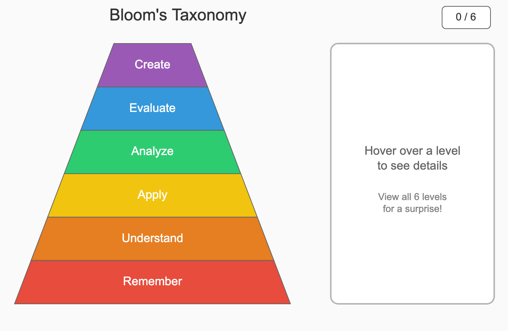

# MicroSims

This section contains interactive MicroSims covering topics in automating instructional design including learning objectives analysis, cognitive load theory, visualization paradigms, Bloom's Taxonomy, evaluation frameworks, and AI-assisted content generation. Each simulation allows students to explore instructional design concepts through hands-on experimentation and visualization.

- **[Acceptance Test Matrix](./acceptance-test-matrix/index.md)**

    An interactive matrix for tracking MicroSim acceptance criteria across functional, pedagogical, technical, and assessment dimensions with pass/fail tracking and markdown export.

- **[Accessibility Audit Workflow](./accessibility-audit-workflow/index.md)**

    An interactive flowchart for conducting systematic accessibility audits on MicroSims, evaluating keyboard navigation, screen reader compatibility, color contrast, motion, and touch accessibility.

- **[Accessible Control Layout](./accessible-control-layout/index.md)**

    An interactive diagram showing recommended MicroSim structure with proper accessibility for mouse, keyboard, and screen reader users.

- **[AI Generation Workflow](./ai-generation-workflow/index.md)**

    Interactive workflow showing the AI-assisted generation process for creating educational MicroSims.

- **[Animation Control Guide](./animation-control-guide/index.md)**

    A guide for implementing effective animation controls in MicroSims for optimal learning experiences.

- **[Automated vs Human Evaluation Matrix](./automated-human-evaluation/index.md)**

    An interactive 2x2 matrix that helps students distinguish evaluation criteria suitable for automation versus those requiring human judgment.

- **[Bloom's Taxonomy MicroSim Types](./bloom-microsim-types/index.md)**

    An interactive pyramid infographic showing appropriate MicroSim types for each level of Bloom's Taxonomy, with design considerations and case studies.

- **[Bloom's Taxonomy](./bloom-taxonomy/index.md)**

    
    An interactive pyramid visualization of Bloom's Revised Taxonomy showing the six cognitive levels from Remember to Create with detailed hover information.

- **[Bloom's Taxonomy Action Verb Wheel](./bloom-wheel/index.md)**

    An interactive tool for selecting appropriate action verbs when writing learning objectives at different Bloom's Taxonomy levels.

- **[Bloom's Taxonomy Pyramid](./blooms-pyramid/index.md)**

    An interactive visualization of Bloom's Taxonomy showing the six cognitive levels from Remember to Create, with hover descriptions and click-through examples.

- **[Cause-Effect Display](./cause-effect-display/index.md)**

    An interactive demonstration of the standard MicroSim structure with a control panel for input variables (causes) and a visualization area showing output effects (water state changes).

- **[Chapter 1 Concept Map](./chapter1-concept-map/index.md)**

    An interactive concept map showing the relationships between all 17 concepts covered in Chapter 1 - Foundations of Learning Objective Analysis.

- **[Chart Selection Helper](./chart-selection/index.md)**

    An interactive tool that helps learners choose the appropriate chart type based on their data type and the question they want to answer.

- **[Chart Type Selection Guide](./chart-type-selection/index.md)**

    An interactive infographic that helps learners quickly identify the appropriate chart type based on their data characteristics and communication goals.

- **[Classification Matrix](./classification-matrix/index.md)**

    An interactive 2x2 classification matrix where learners drag and drop items to classify them by two criteria - complexity and impact.

- **[Claude Code Skills Architecture](./claude-code-architecture/index.md)**

    An interactive visualization of the Claude Code skills system architecture.

- **[Cognitive Development Progression Chart](./cognitive-development-chart/index.md)**

    Interactive chart showing cognitive development stages and their implications for instructional design.

- **[Cognitive Load Meter](./cognitive-load-meter/index.md)**

    An interactive meter visualization that demonstrates cognitive load theory by allowing learners to adjust instructional design parameters and observe real-time load calculations.

- **[Cognitive Load Simulator](./cognitive-load-simulator/index.md)**

    An interactive simulator for experimenting with instructional design choices and visualizing their impact on intrinsic, extraneous, and germane cognitive load.

- **[Cognitive Load Types](./cognitive-load-types/index.md)**

    An interactive visualization of the three types of cognitive load in learning contexts.

- **[Color Blindness Simulator](./color-blindness-simulator/index.md)**

    An interactive tool for testing MicroSim color schemes against various types of color blindness.

- **[Concept Dependencies Graph](./concept-dependencies/index.md)**

    An interactive directed acyclic graph showing concept dependencies with REQUIRES and SUPPORTS edge types, allowing users to explore prerequisite relationships.

- **[Corporate Learning Module Workflow](./corporate-learning-module/index.md)**

    Interactive workflow for designing corporate training modules using MicroSims.

- **[Design-Test-Refine Cycle](./design-test-refine-cycle/index.md)**

    An interactive visualization of the iterative design process for educational simulations.

- **[Design Tradeoff Decision Tree](./design-tradeoff-tree/index.md)**

    An interactive decision tree that provides a systematic framework for making design tradeoff decisions, helping designers think through common choice points in educational simulation design.

- **[Early Childhood MicroSim Pattern](./early-childhood-pattern/index.md)**

    Design patterns and guidelines for creating MicroSims appropriate for early childhood learners.

- **[Educational Technology Ecosystem](./ed-tech-ecosystem/index.md)**

    An interactive network diagram showing the interconnected components of modern educational technology organized in concentric rings around the learner.

- **[Edge Case Discovery Simulator](./edge-case-discovery/index.md)**

    An interactive simulation where students experiment with physics parameters to identify edge cases like negative gravity, oversized objects, and energy conservation violations.

- **[Elementary Scaffolding Progression](./elementary-scaffolding/index.md)**

    Interactive visualization of scaffolding strategies for elementary-level learners.

- **[Engagement-Learning Tradeoff](./engagement-learning-tradeoff/index.md)**

    An interactive scatter plot exploring the relationship between engagement features and learning effectiveness, helping designers find the optimal balance.

- **[Evaluation Rubric Builder](./evaluation-rubric-builder/index.md)**

    An interactive tool for creating custom evaluation rubrics by selecting and weighting criteria from categories including Technical, Pedagogical, UX Design, and Domain-Specific considerations.

- **[Learning Graph Viewer](./graph-viewer/index.md)**

    Interactive viewer for exploring learning graphs with search functionality and taxonomy legend controls.

- **[Human-AI Collaboration Loop](./human-ai-loop/index.md)**

    An interactive visualization of the human-AI collaboration workflow in instructional design.

- **[Hypothesis Testing Interface](./hypothesis-testing-interface/index.md)**

    An interactive interface for testing hypotheses about learning outcomes.

- **[Information Density Spectrum](./info-density-spectrum/index.md)**

    Interactive visualization showing the spectrum of information density in educational content.

- **[Intent Preservation Matrix](./intent-preservation-matrix/index.md)**

    An interactive hierarchical diagram showing how specification elements trace back to learning objectives, ensuring pedagogical intent is preserved throughout the design process.

- **[Interaction Specification Template](./interaction-spec-template/index.md)**

    An interactive template for specifying MicroSim interactions and behaviors.

- **[Interpretation Pitfalls in User Testing](./interpretation-pitfalls/index.md)**

    An interactive guide to common interpretation pitfalls when evaluating user testing results.

- **[Intuition Testing](./intuition-testing/index.md)**

    An interactive tool for testing learner intuitions before and after MicroSim interactions.

- **[Issue Identification Workflow](./issue-identification-workflow/index.md)**

    An interactive decision tree with testing checkpoints for systematically finding and categorizing issues in generated MicroSim code, guiding users through syntax checks, load tests, visual inspection, functional testing, edge cases, specification review, and code quality assessment.

- **[Iteration Dashboard](./iteration-dashboard/index.md)**

    An interactive dashboard for tracking MicroSim development iterations.

- **[Learning Dependency Network](./learning-dependency-network/index.md)**

    An interactive vis-network visualization demonstrating how learning dependencies between concepts can be represented, showing prerequisites flowing to target learning objectives.

- **[Learning Pathway Explorer](./learning-pathway/index.md)**

    An interactive visualization for exploring learning pathways through prerequisite dependencies. Mark concepts as known, see which concepts unlock, and trace valid paths to learning goals.

- **[Math Relationship Explorer](./math-relationship-explorer/index.md)**

    An interactive visualization for exploring the logistic function f(x) = L/(1 + e^(-k(x-x0))) with parameter manipulation, derivatives, integrals, and mathematical annotations.

- **[Mental Model Formation](./mental-model-formation/index.md)**

    An interactive visualization of how mental models form through learning experiences.

- **[Metadata Search](./metadata-search/index.md)**

    An interactive MicroSim database search tool demonstrating metadata filtering by subject, grade level, JavaScript library, and Bloom's Taxonomy level.

- **[MicroSim Types by Bloom's Taxonomy](./microsim-bloom-types/index.md)**

    Interactive mapping of MicroSim types to appropriate Bloom's Taxonomy levels.

- **[MicroSim Generation Workflow](./microsim-generation-workflow/index.md)**

    An interactive visualization of the complete MicroSim generation workflow.

- **[Misconception Catalog](./misconception-catalog/index.md)**

    An interactive catalog of common misconceptions and strategies for addressing them in educational design.

- **[Misconception Correction Cycle](./misconception-correction-cycle/index.md)**

    An interactive visualization of the cycle for identifying and correcting learner misconceptions.

- **[Model Boundaries](./model-boundaries/index.md)**

    An interactive visualization of the boundaries and limitations of educational models.

- **[Model Comparison Tool](./model-comparison-tool/index.md)**

    An interactive tool for comparing different instructional design models.

- **[Objective Decomposition Tree](./objective-decomposition/index.md)**

    An interactive visualization showing how compound learning objectives decompose into skill clusters and atomic concepts using a hierarchical tree structure.

- **[Ohm's Law Circuit Simulator](./ohms-law-simulator/index.md)**

    An interactive circuit simulator demonstrating Ohm's Law (V = IR) with animated current flow, adjustable voltage and resistance, and real-time calculations.

- **[p5.js MicroSim Architecture](./p5-architecture/index.md)**

    An interactive visualization of the p5.js MicroSim architecture and component structure.

- **[Page View Tracking vs Simulation Tracking](./page-view-tracking-comparison/index.md)**

    Interactive comparison of traditional page view tracking versus detailed simulation interaction tracking.

- **[Paradigm Affordance Matrix](./paradigm-affordance/index.md)**

    An interactive matrix showing how different visualization paradigms (Timeline, Map, Network, Chart, Flowchart) afford different learning interactions across Bloom's Taxonomy levels.

- **[Parameter Space Explorer](./parameter-space-explorer/index.md)**

    An interactive tool for exploring parameter spaces and system behaviors using the Lorenz chaotic system as an example. Features heat map visualization, attractor rendering, and exploration tracking.

- **[Physics Simulation Architecture](./physics-sim-architecture/index.md)**

    An interactive visualization of physics simulation architecture for educational applications.

- **[Portfolio Project Components](./portfolio-components/index.md)**

    Interactive guide to components of a MicroSim development portfolio.

- **[Prediction Prompt Interface](./prediction-prompt-interface/index.md)**

    An interactive interface for prompting learner predictions before revealing simulation outcomes.

- **[Prerequisite vs Assumed Knowledge](./prereq-assumed/index.md)**

    An interactive visualization showing the three layers of knowledge foundations - Assumed Knowledge, Prerequisite Knowledge, and New Content - and how they build upon each other.

- **[Probability Concept Adaptation](./probability-adaptation/index.md)**

    An interactive comparison showing how a single probability concept is adapted for seven different audience levels, from early childhood games to corporate decision tools.

- **[Probability Tree Explorer](./probability-tree-explorer/index.md)**

    An interactive probability tree visualization for understanding compound probabilities when drawing balls without replacement, demonstrating why probabilities multiply along branches.

- **[Process Timeline](./process-timeline/index.md)**

    An interactive process timeline showing the steps in an instructional design workflow. Click steps to highlight and view details, navigate with Previous/Next buttons.

- **[Progressive Disclosure Demonstration](./progressive-disclosure-demo/index.md)**

    An interactive demonstration of progressive disclosure techniques in educational interfaces.

- **[Prompt Engineering Practices](./prompt-engineering-practices/index.md)**

    An interactive infographic providing a quick reference for crafting effective MicroSim generation prompts, organized into five expandable sections with good and bad examples.

- **[Real-World Data Pattern MicroSim](./real-world-data-pattern/index.md)**

    An interactive climate modeling MicroSim that compares simulation-generated data with real-world observations, teaching students to evaluate model accuracy and interpret authentic data patterns.

- **[Relationship Graph Types](./relationship-graph-types/index.md)**

    An interactive visualization demonstrating different types of relationships that can be represented in educational knowledge graphs.

- **[Responsive Breakpoint Testing](./responsive-breakpoint-testing/index.md)**

    An interactive visualization for evaluating MicroSim adaptability across device sizes, from desktop to mobile.

- **[Rule Hierarchy Cascade](./rule-hierarchy-cascade/index.md)**

    An interactive visualization showing how rules cascade through organizational hierarchy levels and how conflicts are resolved using specificity.

- **[Schema Formation Process](./schema-formation-process/index.md)**

    An interactive visualization of how schemas form and evolve through learning experiences.

- **[MicroSim Readiness Assessment](./sim-readiness/index.md)**

    An interactive decision tree flowchart to evaluate if a learning objective is suitable for MicroSim development, assessing interactivity, visualization, feedback, and scope criteria.

- **[Traditional Simulation vs MicroSim Architecture](./sim-vs-microsim/index.md)**

    Side-by-side comparison showing the differences between monolithic traditional simulations and modular MicroSim architecture.

- **[SMART Learning Objectives Framework](./smart-objectives/index.md)**

    An interactive visualization of the SMART framework showing Specific, Measurable, Achievable, Relevant, and Time-bound components for writing effective learning objectives.

- **[Sorting Algorithm Race](./sorting-algorithm-race/index.md)**

    An interactive race visualization comparing sorting algorithm performance.

- **[Spatial Visualization Types](./spatial-viz-types/index.md)**

    An interactive guide showing six types of spatial visualizations - Geographic Map, Schematic Diagram, Floor Plan, Anatomical View, Network Topology, and 3D Model - with guidance on when to use each type.

- **[Specification Quality Checklist](./spec-quality-checklist/index.md)**

    An interactive checklist for evaluating the completeness and quality of MicroSim specifications before generation, covering educational foundation, visual design, interactivity, and technical details.

- **[Split Attention Effect Demonstration](./split-attention-effect/index.md)**

    An interactive demonstration of the split attention effect in learning materials.

- **[Standardization Workflow](./standardization-workflow/index.md)**

    Interactive flowchart showing the MicroSim standardization process for evaluating and upgrading quality scores.

- **[State Machine Template](./state-machine-template/index.md)**

    An interactive template for designing state machines in educational simulations.

- **[Success Criteria Validation Workflow](./success-criteria-workflow/index.md)**

    Interactive workflow for validating MicroSim success criteria.

- **[Think-Aloud Protocol](./think-aloud-protocol/index.md)**

    An interactive guide to conducting think-aloud protocols for MicroSim evaluation.

- **[Three-Lens Evaluation Model](./three-lens-evaluation/index.md)**

    An interactive Venn diagram showing how Technical, Pedagogical, and UX evaluation dimensions interact to form a complete MicroSim quality assessment framework.

- **[Venn Diagram Builder](./venn-builder/index.md)**

    An interactive Venn diagram where learners drag and drop items into the correct regions to understand set relationships and classification.

- **[Visual Description Completeness Checklist](./visual-description-checklist/index.md)**

    An interactive checklist that instructional designers can use to verify their visual descriptions include all essential components for MicroSim specifications.

- **[Visualization Library Decision Tree](./viz-library-decision/index.md)**

    An interactive decision tree that guides learners through selecting the appropriate JavaScript visualization library based on their content type and requirements.

- **[Visualization Paradigm Selection](./viz-paradigm-selection/index.md)**

    An interactive decision tree helping learners identify which visualization paradigm (Timeline, Map, Network Graph, Chart, or Flowchart) best fits their content type.

- **[Working Memory Architecture](./working-memory-architecture/index.md)**

    An interactive visualization of working memory architecture and its role in learning.

- **[xAPI Data Flow](./xapi-data-flow/index.md)**

    An interactive visualization of xAPI data flow in learning analytics systems.

- **[Zone of Proximal Development Visualization](./zpd-visualization/index.md)**

    An interactive visualization of Vygotsky's Zone of Proximal Development showing three concentric learning zones with adjustable scaffolding level.

