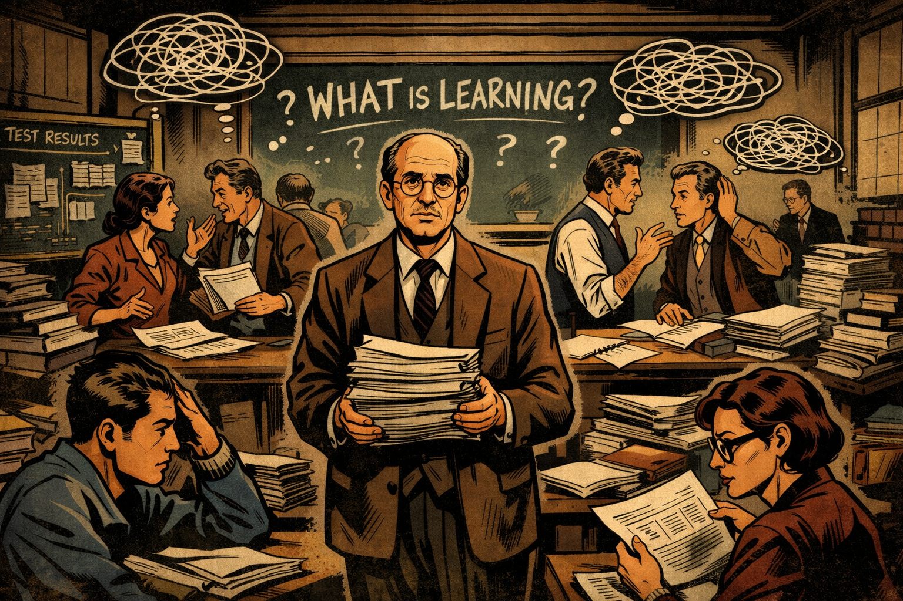
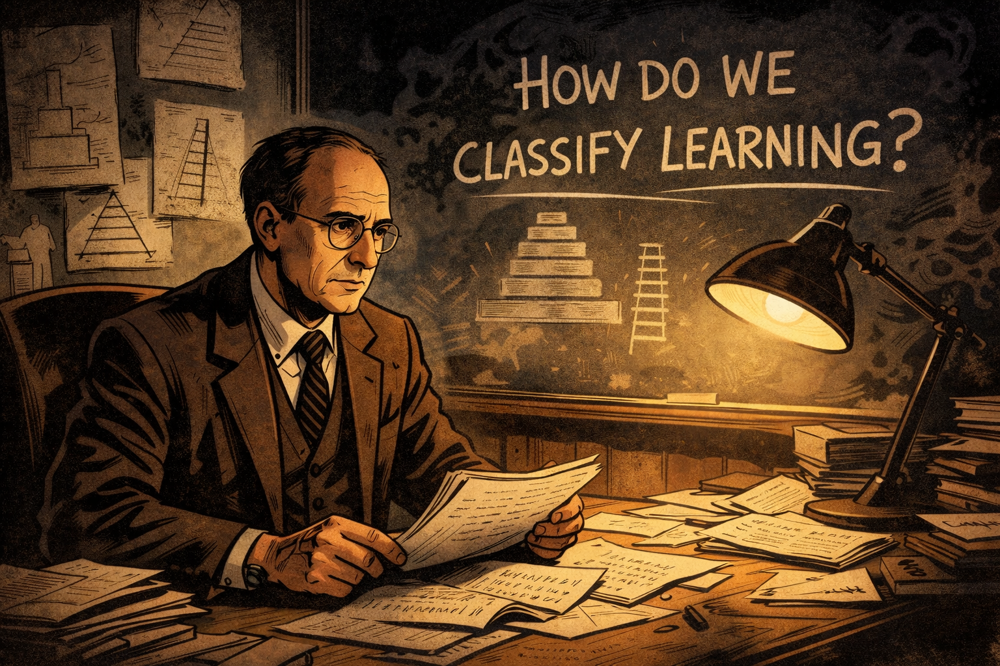
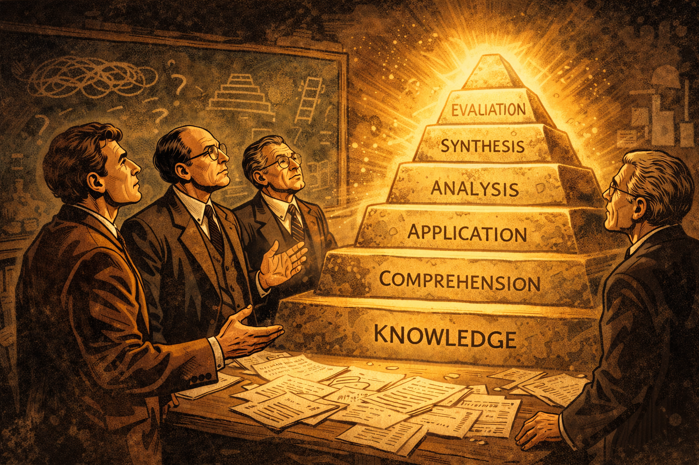
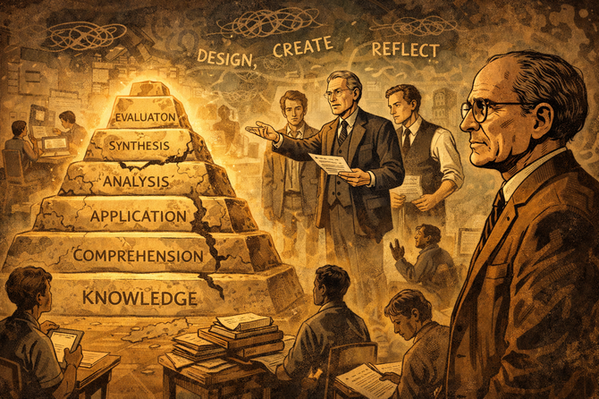
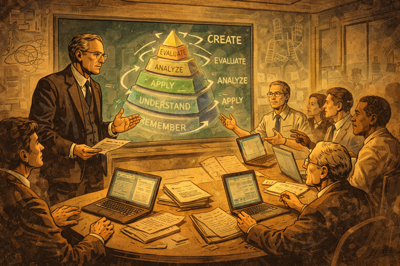
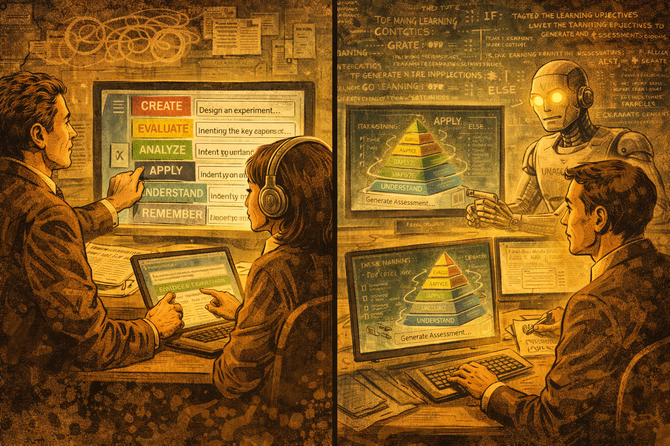
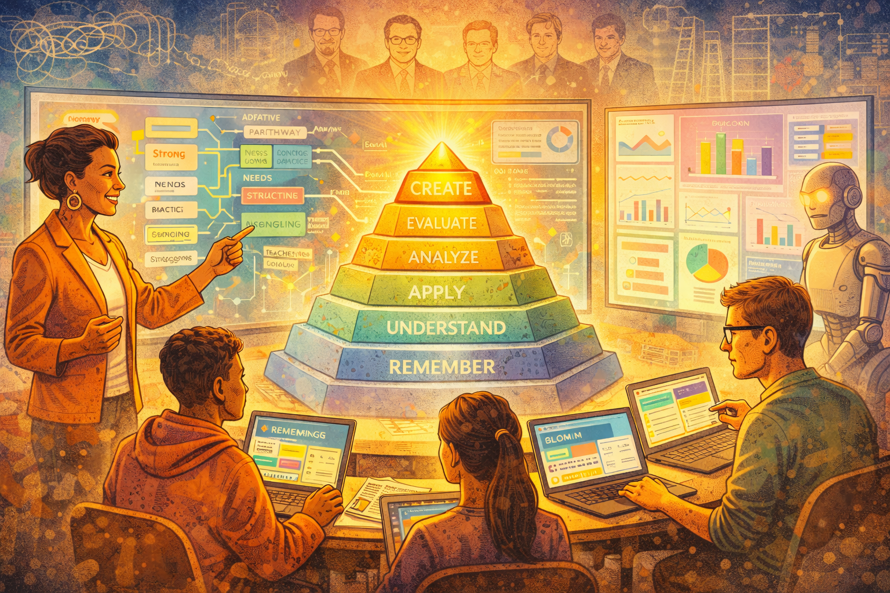
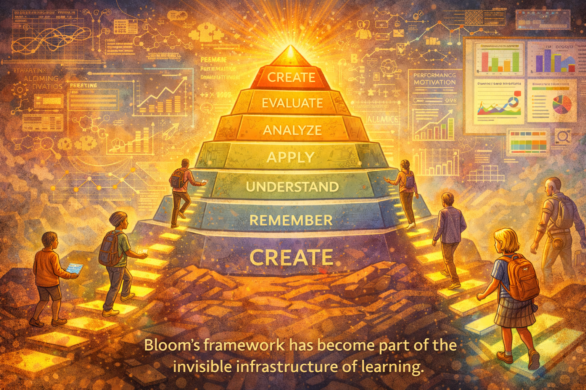
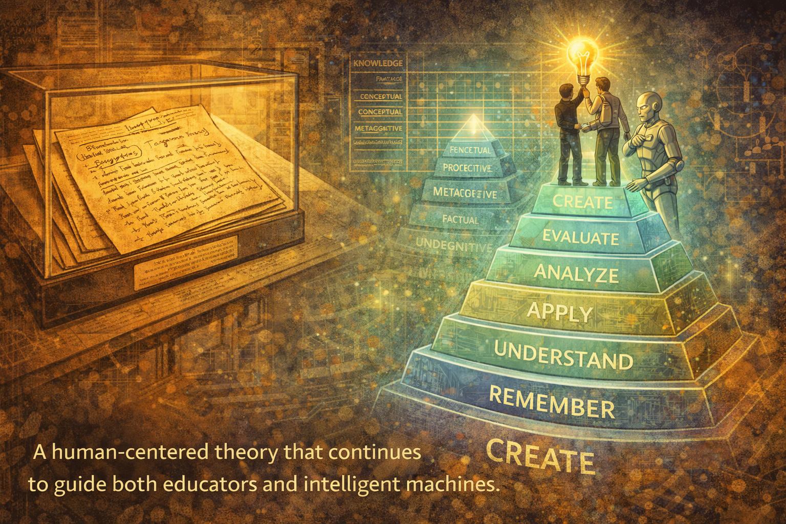

# The Story of Bloom's Taxonomy

## Panel 1: The Problem of Learning

Please generate a new image using a wide-landscape format and a 16:9 width:height aspect ratio.
The image is done in the style of a graphic novel.
A wide establishing shot set in the late 1940s at a university campus. The mood is serious and scholarly. Young educators from different disciplines gather in a dimly lit lecture hall filled with chalkboards, books, and stacks of exam papers. At the center stands Benjamin Bloom, thoughtful and slightly weary, holding a stack of student assessments. The atmosphere suggests confusion and frustration—teachers struggling to agree on what "learning" really means. Visual symbolism: tangled lines above the group's heads representing fragmented thinking about education.

In the years following World War II, American universities faced an unprecedented challenge. Millions of returning soldiers flooded classrooms under the GI Bill, and educators found themselves asking a question that had no clear answer: What does it actually mean to learn something? Benjamin Bloom, a young examiner at the University of Chicago, watched his colleagues argue in circles—each discipline claiming its own definition of knowledge, its own standards for success. The chaos was unsustainable. Someone needed to bring order to the conversation.

## Panel 2: A Question in the Dark

Please generate a new image using a wide-landscape format and a 16:9 width:height aspect ratio.
The image is done in the style of a graphic novel.  Make the characters be consistent with the character in the prior image.

Close-up of Bloom late at night in his office. A single desk lamp illuminates handwritten notes and diagrams. On the wall behind him are sketches of pyramids and ladders, partially erased and rewritten. Bloom looks determined but uncertain, staring at the question written on the chalkboard: "How do we classify learning?" This is the "call to adventure" moment. Shadows loom, symbolizing the complexity of human cognition.

Night after night, Bloom returned to his office, wrestling with a question that seemed impossibly large. How could something as vast and varied as human learning be organized into categories that any teacher, in any subject, could use? He sketched ladders that went nowhere and pyramids that collapsed under scrutiny. The human mind wasn't a filing cabinet—it was a living thing, growing and connecting in ways that defied simple labels. Yet Bloom refused to give up. If learning could be understood, it could be improved. And if it could be improved, then every student—regardless of background—could succeed.

## Panel 3: The Council of Minds

Create a wide-landscape (16:9) illustration in a classic graphic-novel style with hand-inked linework, subtle cross-hatching, and a warm mid-20th-century academic tone. Use a muted sepia and chalkboard-green color palette with soft amber lighting and strong light-and-shadow contrast. Maintain consistent character design for Benjamin Bloom: a slender, clean-shaven man in his 40s with thinning dark hair combed back, round wire-rim glasses, and conservative 1940s academic attire, expressing quiet intelligence and determination. The visual language should emphasize ideas becoming structure through recurring symbols—tangled lines for confusion, ladders and pyramids for insight, and grids for clarity—rendered as chalk drawings, notes, or overlays within the environment. Avoid photorealism, modern fonts, or bright colors; keep the composition cinematic, grounded, and intellectually heroic, ensuring the scene feels part of a cohesive narrative about the organization of human learning.

Bloom meets with fellow scholars—Max Engelhart, Edward Furst, Walter Hill, and David Krathwohl—around a large wooden table. Papers are spread everywhere. The group debates intensely, gesturing and pointing at notes. Speech bubbles (implied) show words like "knowledge," "skills," "evaluation." The scene conveys collaboration as the first step toward order. A rough pyramid diagram begins to take shape in the center of the table.

Bloom knew he couldn't solve this alone. He assembled a team of brilliant minds—psychologists, curriculum specialists, and measurement experts—who shared his obsession with understanding how people think. For years, they met at conferences and in cramped university offices, arguing passionately about where one type of thinking ended and another began. Was "understanding" different from "knowing"? Could "analysis" exist without "application"? Slowly, through countless debates and revisions, patterns began to emerge from the chaos.

## Panel 4: The First Structure Emerges

Panel 4:

Create a wide-landscape (16:9) illustration in a classic graphic-novel style with hand-inked linework, subtle cross-hatching, and a warm mid-20th-century academic tone. Use a muted sepia and chalkboard-green color palette with soft amber lighting and strong light-and-shadow contrast. Maintain consistent character design for Benjamin Bloom: a slender, clean-shaven man in his 40s with thinning dark hair combed back, round wire-rim glasses, and conservative 1940s academic attire, expressing quiet intelligence and determination. The visual language should emphasize ideas becoming structure through recurring symbols—tangled lines for confusion, ladders and pyramids for insight, and grids for clarity—rendered as chalk drawings, notes, or overlays within the environment. Avoid photorealism, modern fonts, or bright colors; keep the composition cinematic, grounded, and intellectually heroic, ensuring the scene feels part of a cohesive narrative about the organization of human learning.

The first Bloom Taxonomy pyramid is revealed dramatically, glowing slightly as if it is a powerful artifact. The six cognitive levels—Knowledge, Comprehension, Application, Analysis, Synthesis, Evaluation—are etched into stone steps. Bloom and his colleagues stand at the base, looking upward with awe. This represents the breakthrough: learning can be structured and shared.

In 1956, the team published their masterwork: *Taxonomy of Educational Objectives*. The framework presented learning as a journey upward through six cognitive levels—from simple recall of facts to the heights of evaluation and judgment. For the first time, educators had a shared language. A history teacher in Boston and a science teacher in Seattle could now discuss "higher-order thinking" and mean the same thing. The taxonomy wasn't just a classification system; it was a map of the mind itself.

## Panel 5: A Framework Spreads Across the World

Panel 5: Create a wide-landscape (16:9) illustration in a classic graphic-novel style with hand-inked linework, subtle cross-hatching, and a warm mid-20th-century academic tone. Use a muted sepia and chalkboard-green color palette with soft amber lighting and strong light-and-shadow contrast. Maintain consistent character design for Benjamin Bloom: a slender, clean-shaven man in his 40s with thinning dark hair combed back, round wire-rim glasses, and conservative 1940s academic attire, expressing quiet intelligence and determination. The visual language should emphasize ideas becoming structure through recurring symbols—tangled lines for confusion, ladders and pyramids for insight, and grids for clarity—rendered as chalk drawings, notes, or overlays within the environment. Avoid photorealism, modern fonts, or bright colors; keep the composition cinematic, grounded, and intellectually heroic, ensuring the scene feels part of a cohesive narrative about the organization of human learning.

A montage-style panel showing classrooms around the world adopting the taxonomy. Teachers point to the pyramid on chalkboards; students climb symbolic steps labeled with the taxonomy levels. Books, lesson plans, and exams now align neatly. Bloom watches from the background, older now, proud but contemplative. The impact is global, but the scene hints that something is still incomplete.

The taxonomy spread like wildfire through education systems worldwide. Textbook publishers restructured their materials around its levels. Governments wrote it into national curricula. Teacher training programs made it required reading. Bloom's pyramid appeared on classroom walls from Tokyo to Toronto, a universal symbol of intellectual growth. Yet as the decades passed and Bloom watched his creation reshape global education, he sensed that something was missing. The world was changing, and the taxonomy would need to change with it.

## Panel 6: Cracks in the Pyramid

Panel 6: Create a wide-landscape (16:9) illustration in a classic graphic-novel style with hand-inked linework, subtle cross-hatching, and a warm mid-20th-century academic tone. Use a muted sepia and chalkboard-green color palette with soft amber lighting and strong light-and-shadow contrast. Maintain consistent character design for Benjamin Bloom: a slender, clean-shaven man now in his 70s with thinning dark hair combed back, round wire-rim glasses, and conservative 1970s academic attire, expressing quiet intelligence and determination. The visual language should emphasize ideas becoming structure through recurring symbols—tangled lines for confusion, ladders and pyramids for insight, and grids for clarity—rendered as chalk drawings, notes, or overlays within the environment. Avoid photorealism, modern fonts, or bright colors; keep the composition cinematic, grounded, and intellectually heroic, ensuring the scene feels part of a cohesive narrative about the organization of human learning.

Time passes. The pyramid begins to crack slightly. New educational challenges appear: computers enter classrooms, diverse learners raise new questions, and verbs like "design," "create," and "reflect" float in the air. Bloom, now elderly, looks on as his former students—especially David Krathwohl—step forward. This is the "passing of the torch" moment.

By the 1990s, the educational landscape had transformed beyond recognition. Computers hummed in classrooms. Cognitive scientists had discovered new truths about how memory and understanding actually worked. Critics pointed out that the original taxonomy used static nouns—"knowledge," "comprehension"—when learning was really about dynamic actions. Most troublingly, "synthesis" and "evaluation" seemed out of order; surely creating something new was the highest form of thinking? Bloom, now in his final years, recognized that his life's work needed heirs who would have the courage to improve upon it.

## Panel 7: Rewriting the Language of Learning

Panel 7: Create a wide-landscape (16:9) illustration in a classic graphic-novel style with hand-inked linework, subtle cross-hatching, and a warm mid-20th-century academic tone. Use a muted sepia and chalkboard-green color palette with soft amber lighting and strong light-and-shadow contrast. The visual language should emphasize ideas becoming structure through recurring symbols—tangled lines for confusion, ladders and pyramids for insight, and grids for clarity—rendered as chalk drawings, notes, or overlays within the environment. Avoid photorealism, modern fonts, or bright colors; keep the composition cinematic, grounded, and intellectually heroic, ensuring the scene feels part of a cohesive narrative about the organization of human learning.

David Krathwohl is depicted as a thoughtful, composed scholar in his late 40s to early 50s, with neatly combed hair beginning to gray at the temples, wire-rim or thin rectangular glasses, and a calm, analytical expression that suggests careful listening before speaking. He wears understated mid-century academic attire and carries himself with quiet confidence, visually signaling a bridge between Bloom’s foundational ideas and the next generation of educational theory.

Krathwohl and Bloom's students are shown in a modern seminar room around the year 2000. Laptops replace notebooks. On a digital screen, the taxonomy is reworked: nouns transform into action verbs. The pyramid rotates and becomes more dynamic. The group debates passionately, refining language and structure to better reflect how people actually learn.

David Krathwohl, who had worked alongside Bloom since the very beginning, took up the mantle. Gathering a new generation of scholars, he led a comprehensive revision that honored Bloom's vision while adapting it for a new century. The static nouns became active verbs: "Knowledge" became "Remember," "Comprehension" became "Understand." Most significantly, "Synthesis" was renamed "Create" and moved to the very top of the pyramid—acknowledging that generating new ideas represents the pinnacle of human cognition.

## Panel 8: A Living Taxonomy

Panel 8: Create a wide-landscape (16:9) illustration in a classic graphic-novel style with hand-inked linework, subtle cross-hatching, and a warm mid-20th-century academic tone. Use a muted sepia and chalkboard-green color palette with soft amber lighting and strong light-and-shadow contrast. The visual language should emphasize ideas becoming structure through recurring symbols—tangled lines for confusion, ladders and pyramids for insight, and grids for clarity—rendered as chalk drawings, notes, or overlays within the environment. Avoid photorealism, modern fonts, or bright colors; keep the composition cinematic, grounded, and intellectually heroic, ensuring the scene feels part of a cohesive narrative about the organization of human learning.

The Revised Bloom Taxonomy (2001) is unveiled. The levels now read: Remember, Understand, Apply, Analyze, Evaluate, Create. "Create" glows at the top, symbolizing human innovation. A second dimension—a knowledge matrix (Factual, Conceptual, Procedural, Metacognitive)—appears as a grid behind the pyramid. The model feels more alive, adaptable, and future-ready.

The Revised Bloom's Taxonomy, published in 2001, wasn't just an update—it was a transformation. The new framework added a second dimension: the Knowledge Dimension, which distinguished between factual, conceptual, procedural, and metacognitive knowledge. Now educators could ask not just "What level of thinking?" but also "What type of knowledge?" The taxonomy had evolved from a simple ladder into a sophisticated matrix, capable of describing the full complexity of human learning.

## Panel 9: Bridging Minds and Machines

Panel 9: Create a wide-landscape (16:9) illustration in a classic graphic-novel style with hand-inked linework, subtle cross-hatching, and a warm mid-20th-century academic tone. Use a muted sepia and chalkboard-green color palette with soft amber lighting and strong light-and-shadow contrast. The visual language should emphasize ideas becoming structure through recurring symbols—tangled lines for confusion, ladders and pyramids for insight, and grids for clarity—rendered as chalk drawings, notes, or overlays within the environment. Avoid photorealism, modern fonts, or bright colors; keep the composition cinematic, grounded, and intellectually heroic, ensuring the scene feels part of a cohesive narrative about the organization of human learning.

A split-panel effect shows the taxonomy being embedded into digital systems. On one side, instructional designers tag learning objectives with taxonomy levels. On the other, early AI systems and rule-based tutors use these tags to generate lessons and assessments. Lines of code subtly intertwine with the taxonomy steps, suggesting a bridge between human cognition and machines.

As computers grew more powerful, something remarkable happened: Bloom's taxonomy became a bridge between human thinking and machine logic. Instructional designers began tagging learning objectives with taxonomy levels, creating structured data that software could understand. Early intelligent tutoring systems used these tags to sequence lessons and generate appropriate questions. The taxonomy—born from handwritten notes and heated debates—had become a protocol that allowed humans to communicate with machines about the nature of learning itself.

## Panel 10: Learning at Scale

Panel 10: Create a wide-landscape (16:9) illustration in a classic graphic-novel style with hand-inked linework, subtle cross-hatching, and a brighter modern academic tone. Use a warm color palette with soft amber lighting and strong light-and-shadow contrast. The visual language should emphasize ideas becoming structure through recurring symbols—tangled lines for confusion, ladders and pyramids for insight, and grids for clarity—rendered as modern graphics drawings, notes, or overlays within the environment. Avoid photorealism, and user modern fonts, and brighter colors; keep the composition cinematic, grounded, and intellectually heroic, ensuring the scene feels part of a cohesive narrative about the organization of human learning.

Fast-forward to the present and near future. Intelligent instructional design tools automatically generate lesson plans, assessments, and adaptive pathways. Dashboards visualize Bloom levels in real time. Teachers act as guides, not lecturers. Bloom and his students appear as semi-transparent mentor figures in the background, watching their ideas power AI-driven education.

Today, artificial intelligence systems can generate entire curricula aligned to Bloom's levels, automatically creating assessments that target specific cognitive skills. Adaptive learning platforms track each student's progress through the taxonomy in real time, offering personalized pathways that would have seemed like science fiction to Bloom and his colleagues. Teachers, freed from the burden of creating every lesson from scratch, can focus on what they do best: inspiring curiosity, providing mentorship, and nurturing the human connections that no algorithm can replace.

## Panel 11: The Invisible Infrastructure

Panel 11: Create a wide-landscape (16:9) illustration in a classic graphic-novel style with hand-inked linework, subtle cross-hatching, and a brighter modern academic tone. Use a warm color palette with soft amber lighting and strong light-and-shadow contrast. The visual language should emphasize ideas becoming structure through recurring symbols—tangled lines for confusion, ladders and pyramids for insight, and grids for clarity—rendered as modern graphics drawings, notes, or overlays within the environment. Avoid photorealism, and user modern fonts, and brighter colors; keep the composition cinematic, grounded, and intellectually heroic, ensuring the scene feels part of a cohesive narrative about the organization of human learning.

A heroic culmination scene. The taxonomy stands tall like a timeless monument, now integrated with graphs, algorithms, and learning analytics. Diverse learners—children, adults, neurodiverse students—climb personalized paths. The model adapts without losing its core structure. A caption implies that Bloom's framework has become part of the invisible infrastructure of learning.

Most learners today have never heard of Benjamin Bloom, yet his ideas shape their education every day. The taxonomy has become invisible infrastructure—embedded in learning management systems, encoded in assessment algorithms, woven into the fabric of how we think about thinking. Like the electrical grid or the internet, it works so well that we forget it's there. Children in rural villages and executives in corporate boardrooms climb the same cognitive ladder, often without knowing it has a name.

## Panel 12: A Legacy That Creates

Panel 12: Create a wide-landscape (16:9) illustration in a classic graphic-novel style with hand-inked linework, subtle cross-hatching, and a warm mid-20th-century academic tone. Use a muted sepia and chalkboard-green color palette with soft amber lighting and strong light-and-shadow contrast. Maintain consistent character design for Benjamin Bloom: a slender, clean-shaven man in his 40s with thinning dark hair combed back, round wire-rim glasses, and conservative 1940s academic attire, expressing quiet intelligence and determination. The visual language should emphasize ideas becoming structure through recurring symbols—tangled lines for confusion, ladders and pyramids for insight, and grids for clarity—rendered as chalk drawings, notes, or overlays within the environment. Avoid photorealism, modern fonts, or bright colors; keep the composition cinematic, grounded, and intellectually heroic, ensuring the scene feels part of a cohesive narrative about the organization of human learning.

Final reflective panel. Bloom's original handwritten notes rest in a museum-like archive, while holographic versions of the taxonomy project into the air nearby. A closing visual metaphor shows a learner at the top of the structure, creating something new, while an AI assistant quietly supports them. The legacy is clear: a human-centered theory that continues to guide both educators and intelligent machines.

And so the story continues. Benjamin Bloom set out to answer a simple question—"What does it mean to learn?"—and created a framework that would outlive him by generations. His taxonomy has been revised, digitized, and embedded into artificial intelligence, yet its core insight remains unchanged: human cognition is not random but structured, not fixed but developmental. Every learner can climb higher. Every mind can create. In an age of intelligent machines, Bloom's most enduring gift may be this: a reminder that education, at its heart, is about helping humans become more fully themselves.
